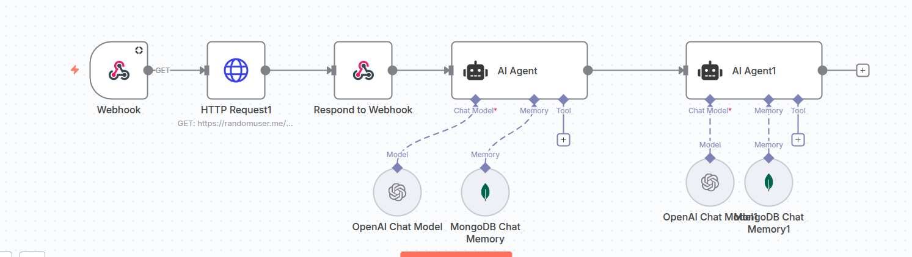

# 🤖 N8N Multi-Agent AI Workflow System

A sophisticated n8n workflow that implements dual AI agents with persistent memory, webhook triggers, and intelligent routing. This system enables complex conversational AI with context retention using OpenAI Chat Models and MongoDB for memory storage.



---


## 📋 Table of Contents

- [Overview](#overview)
- [Architecture](#architecture)
- [Workflow Components](#workflow-components)
- [Prerequisites](#prerequisites)
- [Installation](#installation)
- [Configuration](#configuration)
- [Usage](#usage)
- [AI Agents](#ai-agents)
- [Memory Management](#memory-management)
- [API Reference](#api-reference)
- [Advanced Features](#advanced-features)
- [Troubleshooting](#troubleshooting)
- [Best Practices](#best-practices)
- [Contributing](#contributing)

---

## 🌟 Overview

This n8n workflow implements a **multi-agent AI system** with the following capabilities:

### Key Features

✅ **Dual AI Agents**: Two independent agents with specialized capabilities
✅ **Webhook Triggers**: RESTful API endpoints for external integration
✅ **Persistent Memory**: MongoDB-backed conversation history
✅ **Conditional Routing**: Intelligent request distribution between agents
✅ **OpenAI Integration**: Powered by GPT-4 or GPT-3.5-turbo
✅ **Scalable Architecture**: Modular design for easy expansion
✅ **Real-time Processing**: Instant response generation
✅ **Context Awareness**: Maintains conversation context across sessions

### Use Cases

- 🎯 **Customer Support**: Multi-tier support with escalation
- 💬 **Conversational AI**: Context-aware chatbots
- 🔄 **Workflow Automation**: Intelligent task routing
- 📊 **Data Analysis**: Agent specialization for different queries
- 🛠️ **Tool Integration**: Agents with different tool access
- 🎓 **Learning Systems**: Adaptive responses based on history

---

## 🏗️ Architecture

### System Flow Diagram

```
┌─────────────────────────────────────────────────────────────────┐
│                         External Systems                         │
│                    (Web Apps, APIs, Services)                    │
└────────────────────────────┬────────────────────────────────────┘
                             │
                             │ HTTP POST
                             ▼
                    ┌────────────────┐
                    │   Webhook      │
                    │   Trigger      │
                    └────────┬───────┘
                             │
                             │ Payload
                             ▼
                    ┌────────────────┐
                    │ HTTP Request1  │
                    │ (Optional)     │
                    └────────┬───────┘
                             │
                             │ Data Fetch
                             ▼
                    ┌────────────────┐
                    │  Respond to    │
                    │   Webhook      │
                    └────────┬───────┘
                             │
                ┌────────────┴────────────┐
                │                         │
                ▼                         ▼
        ┌───────────────┐        ┌───────────────┐
        │  AI Agent 1   │        │  AI Agent 2   │
        │               │        │               │
        │ ┌───────────┐ │        │ ┌───────────┐ │
        │ │Chat Model │ │        │ │Chat Model │ │
        │ └─────┬─────┘ │        │ └─────┬─────┘ │
        │       │       │        │       │       │
        │ ┌─────▼─────┐ │        │ ┌─────▼─────┐ │
        │ │  Memory   │ │        │ │  Memory   │ │
        │ └─────┬─────┘ │        │ └─────┬─────┘ │
        │       │       │        │       │       │
        │ ┌─────▼─────┐ │        │ ┌─────▼─────┐ │
        │ │   Tools   │ │        │ │   Tools   │ │
        │ └───────────┘ │        │ └───────────┘ │
        └───────┬───────┘        └───────┬───────┘
                │                        │
                │    ┌───────────────┐   │
                └───►│   MongoDB     │◄──┘
                     │ Chat Memory   │
                     └───────────────┘
                             │
                             │ Response
                             ▼
                    ┌────────────────┐
                    │  Return Data   │
                    │  to Webhook    │
                    └────────────────┘
```

### Component Architecture

```
┌─────────────────────────────────────────────────────────────┐
│                    N8N Workflow Layer                        │
├──────────────┬──────────────┬──────────────┬────────────────┤
│   Webhook    │HTTP Request  │   Routing    │    Response    │
│   Handler    │   Node       │    Logic     │   Generator    │
└──────────────┴──────────────┴──────────────┴────────────────┘
                             │
┌─────────────────────────────────────────────────────────────┐
│                    AI Agent Layer                            │
├──────────────────────────────┬──────────────────────────────┤
│       AI Agent 1             │       AI Agent 2             │
│  ┌────────────────────────┐  │  ┌────────────────────────┐  │
│  │  OpenAI Chat Model     │  │  │  OpenAI Chat Model     │  │
│  │  - Model: GPT-4        │  │  │  - Model: GPT-4        │  │
│  │  - Temperature: 0.7    │  │  │  - Temperature: 0.7    │  │
│  │  - Max Tokens: 1000    │  │  │  - Max Tokens: 1000    │  │
│  └────────────────────────┘  │  └────────────────────────┘  │
└──────────────────────────────┴──────────────────────────────┘
                             │
┌─────────────────────────────────────────────────────────────┐
│                    Memory Layer                              │
├──────────────────────────────┬──────────────────────────────┤
│   MongoDB Chat Memory 1      │   MongoDB Chat Memory 2      │
│  ┌────────────────────────┐  │  ┌────────────────────────┐  │
│  │  Session Management    │  │  │  Session Management    │  │
│  │  Conversation History  │  │  │  Conversation History  │  │
│  │  Context Retrieval     │  │  │  Context Retrieval     │  │
│  └────────────────────────┘  │  └────────────────────────┘  │
└──────────────────────────────┴──────────────────────────────┘
                             │
┌─────────────────────────────────────────────────────────────┐
│                   Storage Layer                              │
│                                                               │
│              MongoDB Database Cluster                        │
│  ┌───────────────────────────────────────────────────────┐  │
│  │  Collections:                                          │  │
│  │  - agent1_conversations                               │  │
│  │  - agent2_conversations                               │  │
│  │  - session_metadata                                   │  │
│  └───────────────────────────────────────────────────────┘  │
└─────────────────────────────────────────────────────────────┘
```

---


Built with using n8n, OpenAI, webhook url and MongoDB
